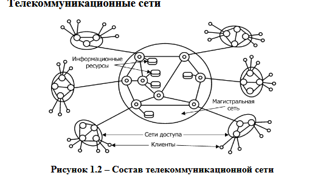
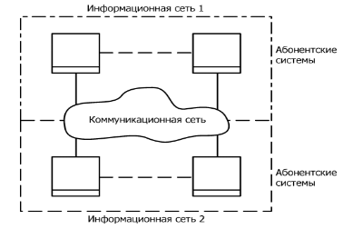

# Основные понятия дисциплины

**Сеть (Network)** – взаимодействующая совокупность объектов (**узлов**, _nodes_).

**Компьютерная сеть или сеть передачи данных (Computer Network)** – это совокупность связанных между собой компьютеров, телекоммуникационного оборудования и программного обеспечения, обеспечивающая информационный обмен между компьютерами в сети.

**Узел компьютерной сети** – хост или конечная система. Конечные системы соединяются между собой при помощи линий связи и коммутаторов пакетов.

**Пакеты** – отдельные порции информации, передаваемые по сети.

### Состав компьютерной сети:
*   Компьютеры, соответствующие назначению компьютерной сети;
*   Коммуникационное оборудование;
*   Сетевые операционные системы (**NOS** – Network Operation System);
*   Сетевые приложения.

**Телекоммуникации** – (греч. _tele_ – вдаль, далеко и лат. _communicatio_ – общение) – это передача и прием любой информации (звука, изображения, данных, текста) на расстояние по различным электромагнитным системам.

**Телекоммуникационная сеть** – это система технических средств, посредством которой осуществляются телекоммуникации.

Телекоммуникационную сеть условно принято разделять на коммуникационную сеть и информационную сеть (см. рис. 1.1).

*   **Коммуникационная сеть** – предназначена для передачи данных.
*   **Информационная сеть** – предназначена для обработки, хранения и передачи данных и создается подключением к коммуникационной сети абонентских систем.

**Рисунок 1.1 – Структура телекоммуникационной сети**

К телекоммуникационным сетям относятся:
*   Компьютерные сети (передача данных);
*   Телефонные сети (передача голосовой информации);
*   Радиосети (передача голосовой информации – широковещательные услуги);
*   Телеграфные сети (передача текстовых сообщений);
*   Телевизионные сети и т.д.

**Рисунок 1.2 – Состав телекоммуникационной сети**

### Состав телекоммуникационных сетей (см. рис. 1.2):
*   **Сети доступа (access network)** – нижний уровень ТС, к которому подключаются «конечные узлы» – оборудование пользователей.
*   **Магистральная сеть или магистраль (core network или backbone)** – объединяет СД и выполняет транзит трафика по высокоскоростным каналам.
*   **Информационные центры или центры управления сервисами (data centers или service control point)** – собственные информационные ресурсы сети, на основе которых выполняется обслуживание пользователей.

## Классификации сетей
*   По территориальному признаку
*   По масштабу производственного объединения
*   По технологии передачи
*   По принципу организации обмена данными между абонентами
*   По типу среды передачи данных
*   По принципу организации иерархии компьютеров и т.д.

### Классификация сетей по территориальному признаку:
*   **Локальные сети (ЛС, LAN – Local Area Network)** – сеть ЭВМ, включающая в себя узлы, расположенные в пределах одного помещения, здания или небольшой территории, позволяющая обмениваться данными и совместно использовать различные устройства.
    *   *Примеры:* компьютерная сеть в отдельной лаборатории университета, локальная сеть главного корпуса университета.
*   **Глобальные сети (ГС, WAN – Wide Area Network)** – сети, объединяющие территориально рассредоточенные компьютеры, возможно находящиеся в различных городах и странах.
    *   *Примеры:* глобальная сеть Интернет, сеть Fido.
*   **Региональные (городские) сети (MAN, Metropolitan Area Network)** – сети, предназначенные для обслуживания территории района, крупного города или региона.
    *   *Пример:* городские сети определенного провайдера интернет-услуг, например, МТС.

### Классификация по масштабу производственного подразделения:
*   Сети отделов (рабочих групп);
*   Сети кампусов (от англ. _campus_ – университет, территория университета), а также домовые сети, объединяющие несколько домов;
*   Корпоративные сети (сети масштаба предприятия – _enterprise wide networks_).

### Классификация по технологии передачи данных:
*   **Вещание (один – ко многим)** использует _broadcast_ или основана на разделяемых каналах передачи данных (_shared channel_);
*   **Соединение точка – точка (point-to-point)** – передача данных ведется между двумя абонентами.

### Классификация по принципу организации обмена данными между абонентами:
**Сети на основе коммутации:**
*   Каналов;
*   Пакетов;
*   Сообщений (промежуточный вариант).

**Коммутация** – технология выбора направления и организации передачи данных в сетях, имеющих несколько альтернативных маршрутов, по которым может производиться обмен информацией между двумя узлами. При этом передаваемые по сети информационные потоки называются **сетевым трафиком** (от англ. _traffic_ – движение).

### Классификация по типу среды передачи данных:
*   **Проводные (wired)** (коаксиальный кабель, витая пара, оптоволоконные линии);
*   **Беспроводные (wireless)** (радиочастоты, инфракрасный диапазон).

### Классификация по принципу организации иерархии компьютеров:
*   **Одноранговые (Peer-to-Peer Network);**
*   **Клиент-серверные (с выделенным сервером, Dedicated Server Network).**
    *   **Сервер** (от англ. _server_ – служащий, служитель) – компьютер или программа, предоставляющая услуги другим компьютерам или программам, обычно называемым клиентами.
    *   **Клиент** – это компьютер или программа, запрашивающая некоторые услуги.
    *   **Распределенная программа** – это программа, состоящая из нескольких взаимодействующих частей, причем каждая часть может выполняться и, как правило, выполняется на отдельном компьютере.

## Основное назначение компьютерных сетей
1.  Обеспечение доступа к разделяемым ресурсам;
2.  Межперсональная коммуникация.

**Разделяемый (сетевой) ресурс (network share)** – это устройство или информация, к которой возможен удалённый доступ с другого компьютера (обычно в ЛС или интранет), как к локальному ресурсу.

**Услуги доступа к ресурсам:**
*   Удаленный доступ (Remote Login);
*   Передача файлов (File Transfer);
*   Удаленный вызов процедур (RPC – Remote procedure call);
*   Совместное использование устройств.

**Услуги межперсональной коммуникации:**
*   Электронная почта (e-mail) `1:1`
*   Списки рассылки (news group) `1:n`
*   Телеконференции `n:n`
*   Системы электронных бюллетеней (BBS – Bulletin Board System)
*   Видеоконференции и т.д.

## История сетей
*   **60-е годы** – DARPA ведет проект по объединению двух удаленных мейнфреймов, первые глобальные связи компьютеров, эксперименты с пакетными сетями, начало передачи голоса по телефонным сетям в цифровой форме.
*   **1969 год** – ARPA (Advanced Research Project Agency) мин.обороны США инициировала работы по объединению в единую сеть суперкомпьютеров оборонных и научно-исследовательских центров – сеть **ARPANET** (см. рис. 1.3–1.4).

#
# Новая лекция

 **ЛВС** - **Локальная вычислительная сеть**
* (ЛВС, англ. LAN — Local Area Network) — это компьютерная сеть, объединяющая вычислительную технику и периферийное оборудование (принтеры, серверы) на небольшой территории, обычно в пределах одного здания, офиса или группы помещений. ЛВС обеспечивает высокоскоростной обмен данными и совместный доступ к ресурсам, используя проводные (Ethernet) или беспроводные (Wi-Fi) технологии. 

#

#

 ## **СКС** — это
структурированная кабельная система, представляющая собой единую физическую инфраструктуру здания или комплекса зданий. Она объединяет локальные вычислительные (ЛВС), телефонные сети, системы видеонаблюдения и безопасности в общую иерархическую структуру. СКС обеспечивает стандартизированную передачу данных, гибкость переключений, высокую надежность и масштабируемость сети
#

## **Тестирование** — это процесс проверки продукта (чаще всего программного обеспечения) на соответствие требованиям, выявление ошибок (багов) и оценка его качества, надежности и удобства, чтобы убедиться в корректной работе перед выпуском для пользователей. Это не только выполнение программы в различных сценариях, но и планирование, анализ результатов и обеспечение качества продукта в целом
#
## **Интеграционное тестирование** — это
этап тестирования ПО, следующий за модульным, на котором отдельные компоненты или модули системы объединяются и проверяются на совместимость и корректность взаимодействия. Его цель — выявить дефекты в обмене данными, несовместимости интерфейсов и ошибках логики между функционально завершенными частями приложения
#

## **Ящики**
**Белый ящик» и «черный ящик»** — это методы тестирования программного обеспечения, различающиеся уровнем доступа к внутреннему устройству системы
. «Черный ящик» проверяет только внешние функции, не зная кода (позиция пользователя), а «белый ящик» тестирует внутреннюю логику и исходный код (позиция разработчика). Их совместное использование обеспечивает максимальное покрытие. 

#
## **Альфа-тестирование** — это
 начальная стадия проверки ПО внутренними специалистами (QA/разработчиками) в изолированной среде для поиска критических ошибок.
## **Бета-тестирование** 
 следует за ним и проводится реальными пользователями (внешней группой) в «боевых» условиях перед релизом для сбора отзывов и выявления мелких недочетов.

 ## **Регрессионное тестирование** — это
  проверка программного обеспечения после внесения изменений (исправлений, новых функций) для подтверждения, что эти изменения не сломали уже работающие функции и не вызвали побочных эффектов, сохраняя общую стабильность и качество продукта. Оно включает повторное выполнение ранее пройденных тестов (тест-кейсов) и часто автоматизируется для ускорения процесса в циклических разработках, таких как Scrum, и выполняется перед каждым релизом 